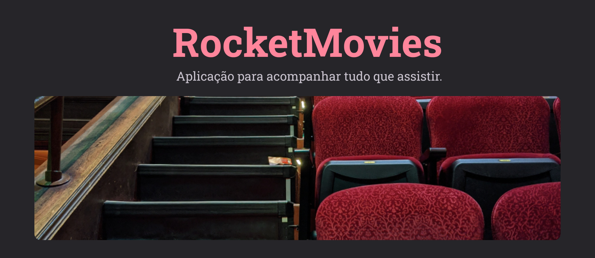

  

Aplicação desenvolvida através de um desafio da rocketseat 

  <a href="#-tecnologias">Tecnologias</a>&nbsp;&nbsp;&nbsp;|&nbsp;&nbsp;&nbsp;
  <a href="#-projeto">Projeto</a>&nbsp;&nbsp;&nbsp;|&nbsp;&nbsp;&nbsp;
  <a href="#memo-licença">Licença</a>

 

### 🛠 Tecnologias

As seguintes ferramentas foram usadas na construção do projeto:

- [Node.js](https://nodejs.org/en/)
- [React](https://pt-br.reactjs.org/)

## 💻 Projeto

[Clique aqui!](https://myrocketmovies.netlify.app/)

Esse é um site onde você consegue organizar os filmes já assistidos, Crie uma conta, Clique em 'Adicionar um filme', então você consegue dar uma nota (de 0 a 5) para esse filme, adicionar um comentário sobre o mesmo, e ainda adicionar tags para ajudar na organização.

## Licença

Esse projeto está sob a licença MIT.

### Autor

---

<a href="https://www.linkedin.com/in/gabriel-alves-vitebo-2978ab177/">
 
  
 <b>Gabriel Vitebo</b></a> <a href="https://www.linkedin.com/in/gabriel-alves-vitebo-2978ab177/" >✅</a>

Feito com ❤️ por Gabriel Vitebo 👋🏽 Entre em contato!

 
  
  
  

